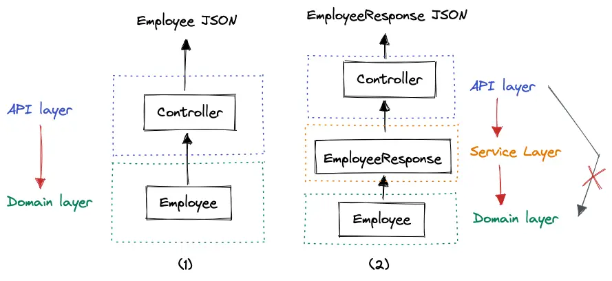

## Summary 
### Enforcing Your Architecture with ArchUnit
 
- A good architecture ensures separation of concerns, which simplifies code changes and unit testing.
- Less dependencies in the codebase make refactoring and splitting up the codebase easier.
- Respecting naming conventions makes the code easier to read and understand.
- A clean architecture can facilitate secure code.